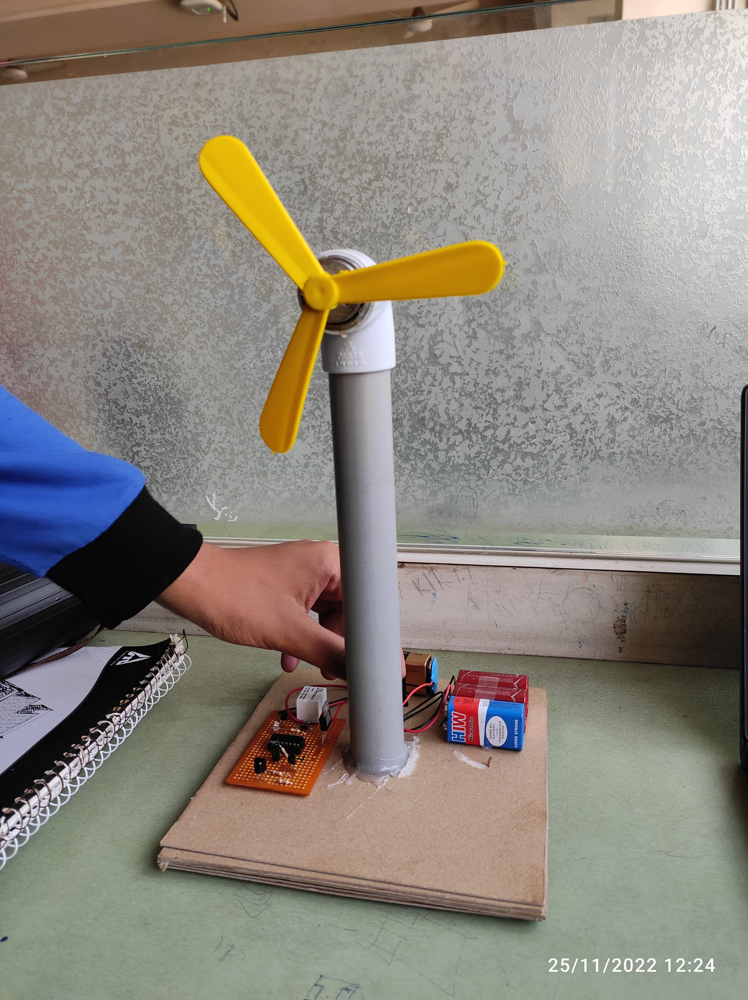

# 🌀 IR Remote-Controlled Fan

A home automation prototype built in **November 2022** that enables users to control a fan wirelessly using a standard IR remote. This DIY project demonstrates the practical integration of analog and digital electronics for automating everyday appliances.

---

## ⚙️ Features

- **IR Remote Operation**: Control the fan wirelessly using common IR remotes (e.g., TV remotes).
- **Pulse Decoding with ICs**: CD4017 Decade Counter + 555 Timer used for decoding IR pulses.
- **Relay-Based Control**: Safe switching of the fan circuit using a relay and BC547 transistor.
- **Compact Build**: Power-efficient and suitable for small-scale automation setups.

---

## 🔩 Technologies Used

- CD4017 Decade Counter
- NE555 Timer IC
- BC547 NPN Transistor
- IR Transmitter & Receiver Modules
- Electromechanical Relay
- DC Fan Motor
- 9V Battery

---

## 🛠️ Skills Gained

- Analog + Digital Circuit Design
- IR Communication Principles
- Timer and Counter IC Configuration
- Relay-Based Switching Mechanism
- DIY Home Automation Techniques

---

## 🖼️ Project Images

> *(Optional: Add circuit photos or prototype images here)*

```html
<table>
  <tr>
    <td></td>
    <td></td>
  </tr>
</table>
